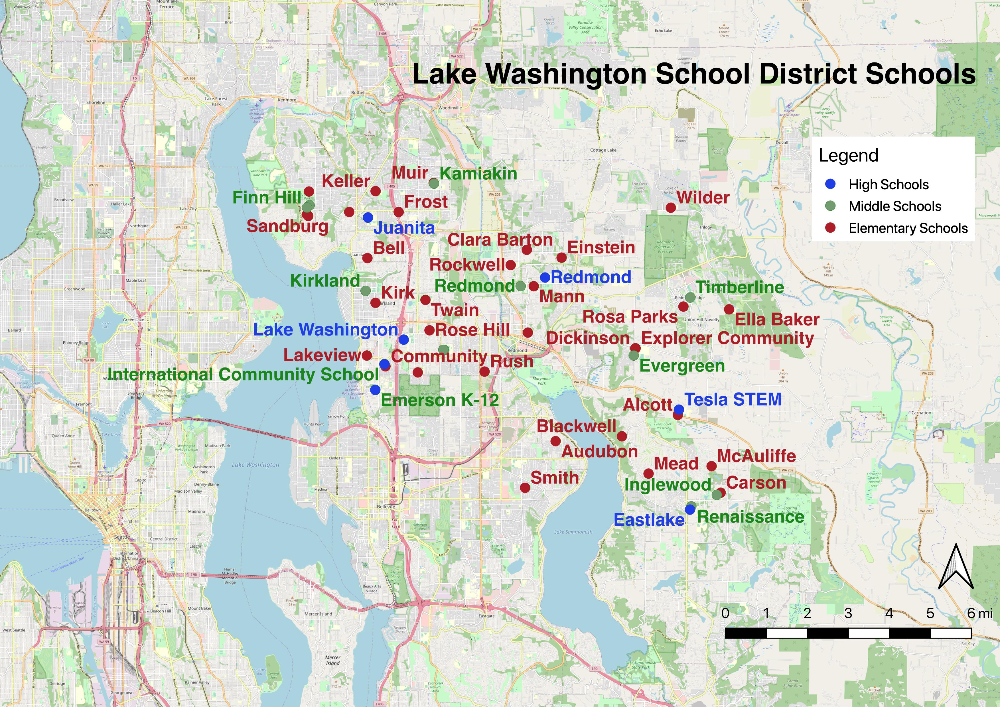
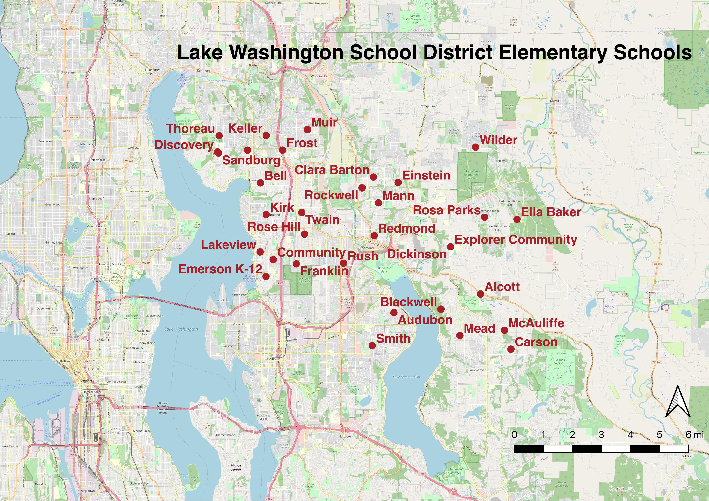
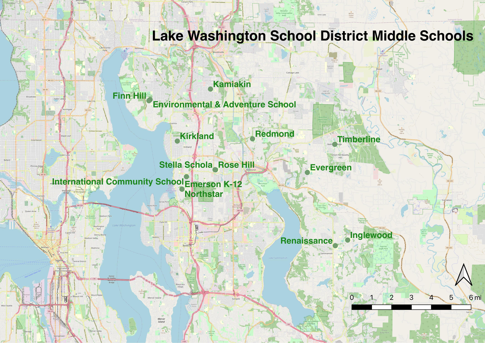
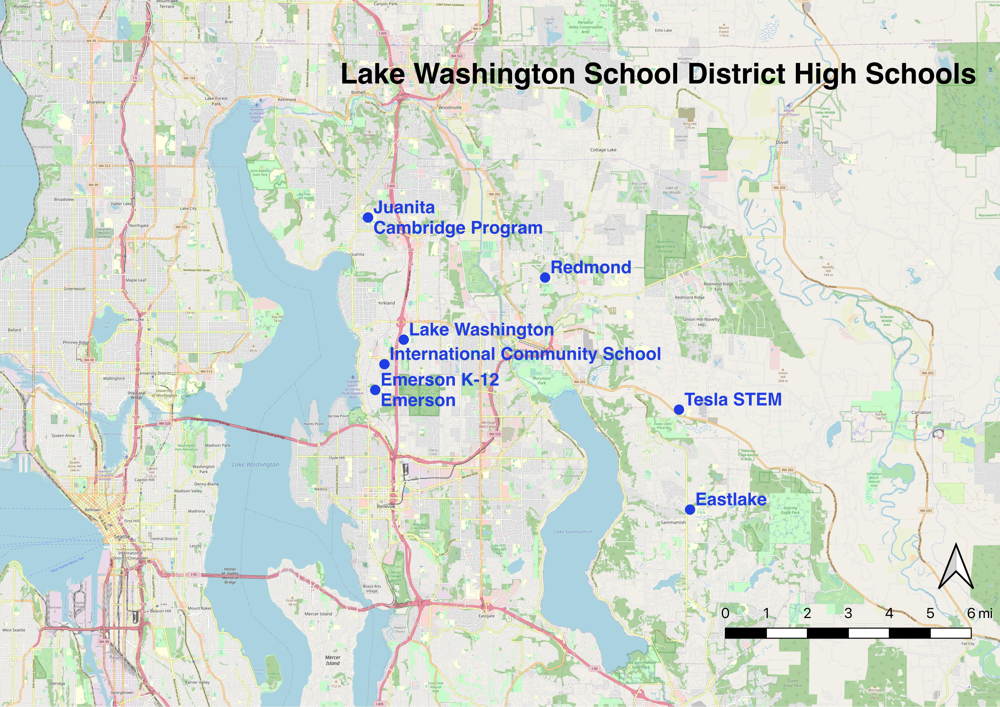

# Lake Washington School District Maps

I created maps of the schools in the Lake Washington School District (LWSD), which is located in the cities of Redmond, Sammamish and Kirkland in King County, Washington. The maps were created using geolocation data from Google Maps and the application QGIS.

## LWSD School Map

This map includes the elementary (red), middle (blue), and high schools in the Lake Washington School District.

## Elementary School Map

This map shows the elementary schools of the Lake Washington School District.

## Middle School Map

This map shows the middle schools of the Lake Washington School District.

## High School Map

This map shows the high schools of the Lake Washington School District.

